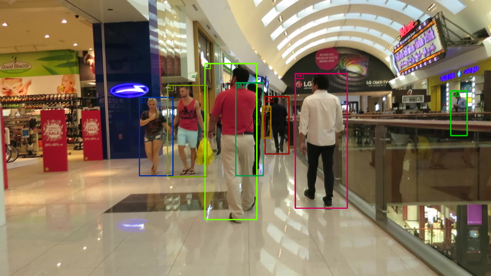
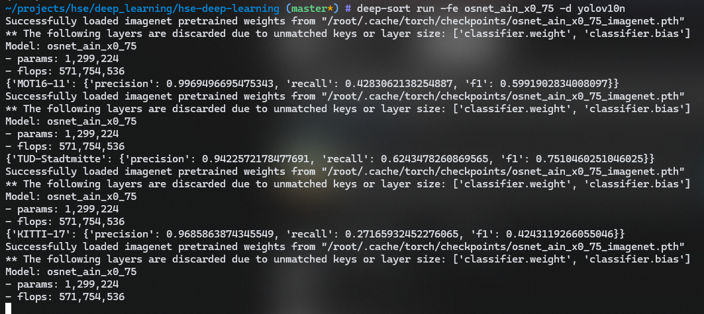

## How to install

### Setup


```bash
make venv
. ./venv/bin/activate
make develop
```

### Commands
Ground truth visualisation - visualise ground truth for test dataset**
```bash
deep-sort ground-truth
```
You as a result you should see this:




Tracker runs the DeepSORT algorithm on all datasets one by one
```bash
deep-sort run -fe [features extractor name] -d [detections provider name]
```

_Note:_ Check out `deep-sort run -h` for a detailed overview of available options


After each video processing you can find result metrics in terminal:




## Results


The main evaluation stages are published in [this Colab](https://colab.research.google.com/drive/158J0p0xg5kQ1ObfVvodpVuHGAFOYKfs).

### Best results:
### yolov10x, osnet_ain_x0_75

```text
                    |F1        |Recall    |Precision |
KITTI-17            |   0.83291|   0.72834|   0.97254|
MOT16-09            |   0.72158|   0.56756|   0.99035|
MOT16-11            |   0.74241|   0.59331|    0.9916|
PETS09-S2L1         |   0.68958|   0.67554|   0.70422|
TUD-Campus          |   0.70491|   0.60563|   0.84313|
TUD-Stadtmitte      |    0.8336|   0.74521|   0.94591|
```
